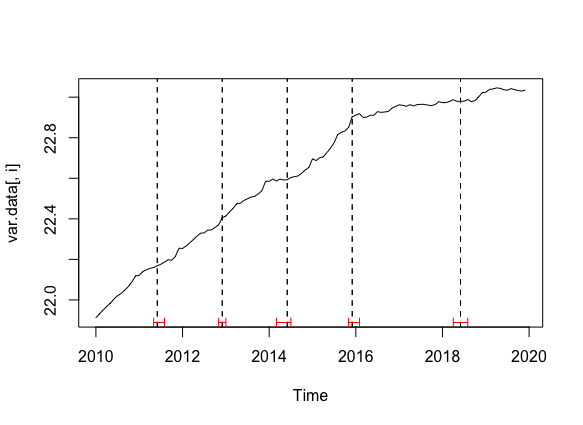
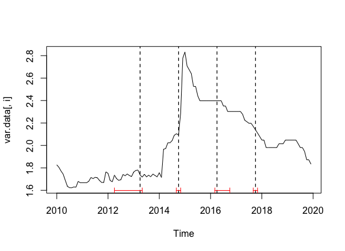

```{r message=FALSE, warning=FALSE, include=FALSE, paged.print=FALSE}
library(tseries)
library(forecast)
library(ggplot2)
library(seasonal)
library(tidyverse)
library(rio)
library(xts)
library(gridExtra)
library(corrplot)
library(lmtest)
library(vars)
library(BigVAR)
library(tsDyn)
library(urca)
library(pander)
library(tinytex)
library(knitr)
#tinytex::install_tinytex()

setwd("~/Documents/GitHub/forecasting/")

#Data import
dd=import('data_for_HW1.xlsx')
colSums(is.na(dd))
date=dplyr::select(dd, Time)
dd=dplyr::select(dd, -Time)

var.data  <- ts(dd[,1:5], start = c(2010, 1,1), frequency = 12)
train.var <- window(var.data, start=c(2010,1), 
                    end=c(2016,12), frequency=12) #The first train sample
test.var  <- window(var.data, start=c(2017,1), frequency=12) # whole test sample
```

Theme of our forecasting project is “Forecasting of individual’s deposits volume of Sberbank with respect to weighted rates and macroeconomic indicators”. 
Firstly, we have to explain the terminology. 
Under weighted rates state for weighted deposit rates in Russian banking industry without Sberbank ones. 

### Data description and preparation procedures
Our data is presented with volume of Sberbank deposits in rubles and macroeconomic indicators as inflation, key rate and  USD/RUB exchange rate. 
On the graph below our data is presented ASIS.

```{r echo=FALSE, message=FALSE, warning=FALSE, paged.print=FALSE}
plot(var.data)
```

The non-stationarity of our time series (TS) and structural break in 2015 can be easily seen from the visualization above. ACF and PACF were constructed only for Deposits data, other variables' ACF and PACF can be found in appendix.

```{r echo=FALSE, message=FALSE, warning=FALSE, paged.print=FALSE}
#facets are required!
for (i in 1:1){
  a<-ggAcf(var.data[,1])
  b<-ggPacf(var.data[,1])
  grid.arrange(a,b)
}
```

The main structural break we have to be careful about was in December, 2014 due to the change in central bank monetary policy: transition to float free-float exchange rate and inflation targeting policy.

```{r echo=FALSE, message=FALSE, warning=FALSE, paged.print=FALSE}


```

In order to overcome problems in raw data, several test and procedures like Box-Cox procedure were provided to transform the data. 
According to the Box-Cox test results our data was transformed in following way: weighted, key rates and deposits: replaced with thier logarithms, USD/RUB with its inverse square root and inflation as it is. 
The estimation of Box-Cox lambda you may find in chart 1.

```{r,echo=FALSE, message=FALSE, warning=FALSE, paged.print=FALSE}
names<-list('', c('Deposits_ind', 'Weighted_rate', 'USDRUB', 'KeyRate', 'Inflation'))
d<-matrix(NA,nrow=1, ncol=5, dimnames = names)
for (i in 1:5){
  d[i]<-BoxCox.lambda(train.var[,i])
}
pander(d)
```
We use auto.arima function in R to automatically select ARIMA model specification. The number of unit roots in the model is automatically checked using standard ADF test. 
As we cannot be sure for 100% in our data-stationarity from visual analysis (ACF, PACF analysis), ADF-tests are presented on chart 2. 
Even with ADF test you cannot be sure in anything, but anyway. :)

```{r echo=FALSE, message=FALSE, warning=FALSE, paged.print=FALSE}
diff_log_dep <-diff(log(var.data[,1]))  
c<-adf.test(diff_log_dep)

  pander(print(c))
```

Then our data was splited into train and test in the following manner: train starts from Jan, 2010 and ends in Dec, 2016; test starts Jan, 2017 and ends in Dec, 2019. 
We defined our forecast-horizon to be equal to 12 months, or 365 days, or 8760 hours, or 525,6 kmin, or 31,536 msec using SI-system. 
As a result of strucchange R package searches it was decided to add a dummy-variable to our analysis in order to solve the problem of structural break in Dec, 2014 without data elimination (unfortunately, there is lack of data from the very beginning: ~~need more data to God of Data~~). 
Then seasonality of our data was checked – no seasonality was found, but X-13 ARIMA has found it. 
We believe to X-13 ARIMA, because it was developed by US Census Bureau and Bank of Spain, they are cool guys. 

```{r message=FALSE, warning=FALSE, include=FALSE, paged.print=FALSE}
var.data[,1] <- log(var.data[,1])
var.data[,2] <- log(var.data[,2])
var.data[,3] <- (sqrt(var.data[,3]))^(-1)
var.data[,4] <- log(var.data[,4])
train.var <- window(var.data, start=c(2010,1), 
                    end=c(2016,12), frequency=12) #The first train sample
test.var  <- window(var.data, start=c(2017,1), frequency=12) # whole test sample
hor  <- 12
Nsmp <- nrow(test.var)
dummy <- var.data*0 
window(dummy, start = c(2014,12)) <- 1
```

```{r echo=FALSE, message=FALSE, warning=FALSE, paged.print=FALSE}
ggseasonplot(train.var[,1], polar = T)
```

### Time series analysis
Time series analysis consists of two global parts: Naïve forecasting and Model based forecasting.

#### Naïve forecasting
Firstly we calculated naïve and snaïve forecasts that gave us following graphs below: 

```{r echo=FALSE, message=FALSE, warning=FALSE, paged.print=FALSE}
#plot(train.var)
n1<-naive(train.var[,1], h=12)
n2<-snaive(train.var[,1], h=12)
grid.arrange(autoplot(n1),autoplot(n2))
```

It’s main idea of those methods is that tomorrow’s value is equal to today’s value. 
This tendency is being kept for a long-run as there is no adjustment to external factors or whole dynamics of TS in this methodology. 
Naïve method usually used for comparison with more complex forecasting methods as a benchmark. 
Seasonal naïve method has similar core idea but it is used for highly seasonal data.

Naïve forecasting method:
$$\hat y_{t+h|t}=y_t$$
Seasonal naïve forecasting method:
$$\hat y_{t+h|t}=y_{t+h \times s(k+1)}$$
s - seasonal period, k - seasonal frequency coef.

To compare out-of-sample forecasting accuracy we use RMSE measure.

```{r echo=FALSE, message=FALSE, warning=FALSE, paged.print=FALSE}
pander(accuracy(n1))
pander(accuracy(n2))
```

### Models

```{r message=FALSE, warning=FALSE, include=FALSE, paged.print=FALSE}
##Models
models <- c('arima', 'ets', 'arimax', 'seas', 'var', 'var_lasso','vecm', 'rwd')
e <- f <-fL<-fH <- lapply(1:length(models), 
            function(i) {matrix(NA, hor, (Nsmp - hor))})
names(e) <- names(f) <-names(fL) <-names(fH) <- models

# NB! Initialize TT before loop!!!
TT   <- nrow(train.var) # length of the first train
criterion <- 1
nn = ncol(var.data)
spec.ets <- rep(NA, Nsmp-hor)
spec.arima <- spec.arimax <- matrix(NA, 7, Nsmp-hor)
spec.var <- rep(NA, Nsmp-hor)

xlg <- 1
Tmax <- nrow(var.data)
Z <- matrix(NA, Tmax, (nn-1)*(xlg+1))
Z[, 1:(nn-1)] <- var.data[, 2:(nn)]
for (ll in 1:xlg) {
  Z[(ll+1):Tmax, ((ll)*(nn-1)+1):((ll+1)*(nn-1))] <- var.data[1:(Tmax-ll), 2:(nn)]
}

for (i in 1:(Nsmp - hor)){
  cat(paste0('Sample ', TT, '\n'))
  # Form train samples
  train.yi <- var.data[1:TT, 1]
  train.xi <- var.data[1:TT, 2:5]
  dtrain.i <- dummy[1:TT]
  
  # Form test samples
  test.yi <- var.data[(TT+1):(TT+hor), 1]
  test.xi <- var.data[(TT+1):(TT+hor), 2:5]
  dtest.i <- dummy[(TT+1):(TT+hor)]
  
  # ARIMA
  m.arima <- auto.arima(train.yi, xreg = dtrain.i)
  f[['arima']][, i] <- forecast( m.arima , xreg = dtest.i, h=hor)$mean
  fL[['arima']][, i] <- forecast( m.arima , xreg = dtest.i, h=hor)$lower[,2]
  fH[['arima']][, i] <- forecast( m.arima , xreg = dtest.i, h=hor)$upper[,2]
  spec.arima[, i] <- m.arima$arma
  #summary(m.arima)
  
  # ARIMAX
  xtr <- Z[(xlg+1):TT, ]
  xte <- Z[(TT+1):(TT+hor), ]
  
  m.arimax <- auto.arima(train.yi[(xlg+1):TT], xreg = xtr)
  f[['arimax']][, i] <- forecast( m.arimax  ,
                                  xreg = xte,
                                  h=hor)$mean
  fL[['arimax']][, i] <- forecast( m.arimax ,
                                   xreg = xte,
                                   h=hor)$lower[,2]
  fH[['arimax']][, i] <- forecast( m.arimax ,
                                   xreg = xte,
                                   h=hor)$upper[,2]
  spec.arimax[, i] <- m.arimax$arma
  
  # X13 SEATS
  seasD <- seas(ts(train.yi, frequency = 12, start = c(2010, 1)))
  seasComponent = seasD$series$s10
  trendComponent = seasD$series$s12
  
  f[['seas']][, i] <- snaive(seasComponent, h = hor)$mean *  
    rwf(trendComponent, drift = TRUE,  h = hor)$mean
  fL[['seas']][, i] <- snaive(seasComponent, h = hor)$mean *  
    rwf(trendComponent, drift = TRUE, h = hor)$lower[,2]
  fH[['seas']][, i] <- snaive(seasComponent, h = hor)$mean *  
    rwf(trendComponent, drift = TRUE,  h = hor)$upper[,2]
  
  # ETS
  m.ets <- ets(train.yi)
  f[['ets']][, i] <- forecast(m.ets, h=hor)$mean
  fL[['ets']][, i] <- forecast( m.ets,
                                   h=hor)$lower[,2]
  fH[['ets']][, i] <- forecast( m.ets,
                                   h=hor)$upper[,2]
  spec.ets[i] <- m.ets$method
  
  # RWD 
  f[['rwd']][,i] <- rwf(train.yi, drift = TRUE, h = hor)$mean
  fL[['rwd']][,i] <- rwf(train.yi, drift = TRUE, h = hor)$lower[,2]
  fH[['rwd']][,i] <- rwf(train.yi, drift = TRUE, h = hor)$upper[,2]
  
  
  # VAR
  lag.sel <- VARselect(var.data[1:TT, ], lag.max = 12)$selection[criterion]
  m.var <- VAR(var.data[1:TT, ], p= lag.sel)
  f[['var']][,i] <- predict(m.var, n.ahead = hor)$fcst[[1]][, 1]
  fL[['var']][,i] <- predict(m.var, n.ahead = hor)$fcst[[1]][, 2]
  fH[['var']][,i] <- predict(m.var, n.ahead = hor)$fcst[[1]][, 3]
  spec.var[i] <- lag.sel
  
  # LASSO VAR
  nlg = lag.sel
  mod.lasso <-constructModel(var.data[1:TT, ], p=lag.sel, 
                             "Basic",gran = c(100000,10),
                             cv="Rolling",
                             MN=TRUE,
                             C = c(1, 1, 1,0, 1),
                             verbose=FALSE)
  cv.res = cv.BigVAR(mod.lasso)
  res =BigVAR.est(mod.lasso)
  tmp.Z = matrix(1, nn*nlg+1, 1);
  for (ik in 1:nlg) {
    tmp.Z[((ik-1)*nn+2):(ik*nn+1), ] <- var.data[TT-ik+1, ]
  }
  BB <- res$B[,,cv.res@index]
  for (kk in 1:hor) {
    f.t <- BB%*%tmp.Z
    f[['var_lasso']][kk, i] <- f.t[1,1]
    tmp.Z[(nn+2):((nlg)*nn+1), ] <- tmp.Z[2:((nlg-1)*nn+1), ]
    tmp.Z[2:(nn+1), ] <- f.t
  }
  
  #VECM
  ca.jo(var.data)
  f[['vecm']][, i]<-predict(vec2var(ca.jo(var.data[1:TT,]), r=1), n.ahead=hor)$fcst[[1]][,1]
  # fL[['vecm']][, i]<-predict(vec2var(ca.jo(var.data), r=1), n.ahead=hor)$lower[[1]][,1]
  # fH[['vecm']][, i]<-predict(vec2var(ca.jo(var.data), r=1), n.ahead=hor)$upper[[1]][,1]
  
  
  # Eval errors
  for (kk in 1:length(models)) {
    e[[kk]][, i] <- test.yi - f[[kk]][, i]
  }
  
  # Next sample
  TT <- TT+1
}

# spec.ets
# spec.arima
# spec.arimax
# spec.var

```


Predictind accuracy of the models was compared with a help of RMSE. 
We estimated ARIMA, ETS, ARIMAX, VAR, VAR with restriction (LASSO), VECM and RWD as benchmark. 
RWD is a variation of naïve forecasting that includes drift as a average historical change during the data horison. 
Visually it can be seen a tendency to growth in deposit value data.

#### ETS 

ETS model is Holt's exponential smoothing method, that decomposes time series into trend, seasonal and error components. 
There are several model specifications, depending on the form of each of these components. 
We use automatical specification search each time we estimate the ETS model. 
We do understand that for each train sample the model specification could be different. 
It means that each forecast made on cross-validation could be generated by different ETS specifications.

```{r echo=FALSE, message=FALSE, warning=FALSE, paged.print=FALSE}
 for (m in 'ets') {
  xx <- ts(var.data[, 1], start = c(2010, 1), frequency = 12)
  ddates <- time(xx)
  for (hh in 1:1) {
    TT   <- nrow(train.var) + hh
    xx0 <- ts(f[[m]][hh, ], start = ddates[TT], frequency = 12)
    xxl <- ts(fL[[m]][hh, ], start = ddates[TT], frequency = 12)
    xxh <- ts(fH[[m]][hh, ], start = ddates[TT], frequency = 12)
    gg <- autoplot(xx, col = 'black')
    gg <- gg + autolayer(xx0, color= 'red') +autolayer(xxl, color = 'blue', linetype= 'dashed')+
      autolayer(xxh, color = 'blue', linetype= 'dashed')
  gg 
    #ggsave(filename = paste0('h_fore_', m, '_h_', hh, '.png'),  
    #      plot = gg)
  }
 }
gg
```

In the majority of samples ($5/6$) the model specification is "MAN", which means multiplicative error, additive trend and no seasonal component. 
The aletrnative specification (which was selected in $1/6$ of cases) is "MAdN", where "Ad" stands for additive damped trend component.


#### ARIMA

ARIMA also called Box-Jenkins model is one of the classical models in applied Time Series Econometrics that explains the dynamics with lag of the variable itself and lag of error terms. 

$$
y_t=\sum_{i=1}^N y_{t-i}+\sum_{j=1}^M e_{t-j}+\epsilon_i
$$

In our case only on train data model has initially (0,1,0) specification that changed to (2,1,0) and (1,1,0) though cross validation process. (I know it is rather strange spec at the first step. It's AIC failure, BIC gave worse results.)
The Visualization of the forecasting values and real values can be seen below:

```{r echo=FALSE, message=FALSE, warning=FALSE, paged.print=FALSE}
 for (m in 'arima') {
  xx <- ts(var.data[, 1], start = c(2010, 1), frequency = 12)
  ddates <- time(xx)
  for (hh in 1:1) {
    TT   <- nrow(train.var) + hh
    xx0 <- ts(f[[m]][hh, ], start = ddates[TT], frequency = 12)
    xxl <- ts(fL[[m]][hh, ], start = ddates[TT], frequency = 12)
    xxh <- ts(fH[[m]][hh, ], start = ddates[TT], frequency = 12)
    gg <- autoplot(xx, col = 'black')
    gg <- gg + autolayer(xx0, color= 'red') +autolayer(xxl, color = 'blue', linetype= 'dashed')+
      autolayer(xxh, color = 'blue', linetype= 'dashed')
  gg 
    #ggsave(filename = paste0('h_fore_', m, '_h_', hh, '.png'),  
    #      plot = gg)
  }
 }
gg
```

ARIMA and ETS use lags only of dependent variable while the next bunch of models use not only lags of predicted variables but also lags of other external variables that can affect regressant. 

#### ARIMAX

ARIMAX is a model that is characterized by forecasting throught not only with the help of dependant variable but also with lags of other variables that may affect the forecast. In our case the forecasts were calculated throught same specification as ARIMA in the first step and transform to (4,1,0) spec at the last step. In the model were used lags of weighted rate, USDRUB, Key rate and Inflation. We took 1 lag for each variable due to AIC (VARselect procedure). The graph is presented below.

```{r echo=FALSE, message=FALSE, warning=FALSE, paged.print=FALSE}
for (m in 'arimax') {
  xx <- ts(var.data[, 1], start = c(2010, 1), frequency = 12)
  ddates <- time(xx)
  for (hh in 1:1) {
    TT   <- nrow(train.var) + hh
    xx0 <- ts(f[[m]][hh, ], start = ddates[TT], frequency = 12)
    xxl <- ts(fL[[m]][hh, ], start = ddates[TT], frequency = 12)
    xxh <- ts(fH[[m]][hh, ], start = ddates[TT], frequency = 12)
    gg <- autoplot(xx, col = 'black')
    gg <- gg + autolayer(xx0, color= 'red') +autolayer(xxl, color = 'blue', linetype= 'dashed')+
      autolayer(xxh, color = 'blue', linetype= 'dashed')
  gg 
    #ggsave(filename = paste0('h_fore_', m, '_h_', hh, '.png'),  
    #      plot = gg)
  }
}

gg
```

#### VAR

Vector autoregerssion of order p (VAR(p) ) models are multivariate dynamic models. In this class of models the whole system of equations is estimated:
$$Y_t = A_0 + A_1 Y_{t-1} + \ldots A_p Y_{t-p} + \varepsilon_t,$$

where $E(\varepsilon_t)=0; var(\varepsilon_t) = \Omega$. 
$Y_t$ is the vector of endogenous variables. 
In our case it consists of log deposits, weighted interest rate, US Dollars to ruble exchange rate, key interest rate and inflation.

```{r echo=FALSE, message=FALSE, warning=FALSE, paged.print=FALSE}
for (m in 'var') {
  xx <- ts(var.data[, 1], start = c(2010, 1), frequency = 12)
  ddates <- time(xx)
  for (hh in 1:1) {
    TT   <- nrow(train.var) + hh
    xx0 <- ts(f[[m]][hh, ], start = ddates[TT], frequency = 12)
    xxl <- ts(fL[[m]][hh, ], start = ddates[TT], frequency = 12)
    xxh <- ts(fH[[m]][hh, ], start = ddates[TT], frequency = 12)
    gg <- autoplot(xx, col = 'black')
    gg <- gg + autolayer(xx0, color= 'red') +autolayer(xxl, color = 'blue', linetype= 'dashed')+
      autolayer(xxh, color = 'blue', linetype= 'dashed')
  }
}
 gg 
```

Contrary to ARIMAX models, VAR allows to predict the whole set of endogenous variables at once. 
It means that VAR forecasts are constructed conditional only on the previous values of endogenous variables, but not conditional on scenario values. 

We use Akaike information criterion (AIC) to choose the lag length $p$ for VAR model. 
The maximum possible lag is $p=12$, due to monthly frequency of the data. 
We automatically select lag length in each sample. 
In all samples, except the last one, selected lag length equals $10$. 
On the final sample lag length is selected to be $p=12$.
In our forecasting exercise we calculate RMSE only for log deposit variable.

#### VAR restricted

In the standard VAR specification there are $n=5$ endogenous variables and $p=10$ lags selected. 
It means that there are $k=51$ parameters in each equation of the VAR system. 
Due to the lack of data this fact could lead to the model overfit. 
To handle this problem we regularize VAR using LASSO-type regularization rules. 
To do this we implement "Basic VARX-L" structure, provided by $bigVAR$ package.

LASSO regularization shifts parameters to zero values, depending on the penalty value. 
The higher the penalty, the lower parameters are in absolute values. 
To choose the penalty value,  we use cross-validation on the rolling window with forecasting horizon equal to $h=1$.

```{r echo=FALSE, message=FALSE, warning=FALSE, paged.print=FALSE}
for (m in 'var_lasso') {
  xx <- ts(var.data[, 1], start = c(2010, 1), frequency = 12)
  ddates <- time(xx)
  for (hh in 1:1) {
    TT   <- nrow(train.var) + hh
    xx0 <- ts(f[[m]][hh, ], start = ddates[TT], frequency = 12)
    xxl <- ts(fL[[m]][hh, ], start = ddates[TT], frequency = 12)
    xxh <- ts(fH[[m]][hh, ], start = ddates[TT], frequency = 12)
    gg <- autoplot(xx, col = 'black')
    gg <- gg + autolayer(xx0, color= 'red') +autolayer(xxl, color = 'blue', linetype= 'dashed')+
      autolayer(xxh, color = 'blue', linetype= 'dashed')
  }
}
 gg 
```


All variables, used in VAR, except key interest rate, are non-stationary. 
To take this fact into account, we used Minnesota prior, which shrinks coefficients towards random walk case. 
Without Minnesota prior forecasts were **very** bad.

#### VECM

Vector error correction model has the following specification:

$$
\Delta Y_t =  \alpha \beta Y_{t-1} + \Gamma_1 \Delta Y_{t-1} + \ldots +\Gamma_{p-1} \Delta Y_{t-p+1} +\nu_t
$$

Linear combinations of endogenous variables $ \beta \times Y_{t-1} $ are cointegration relations that drive first differences of endogenous variables. 
To choose the number of coiintegration relations, we applied trace Johansen test without constant and trend. 
This is due to the fact that the representation of original series $Y_t$ is VAR model with constant.

```{r echo=FALSE, message=FALSE, warning=FALSE, paged.print=FALSE}
for (m in 'vecm') {
  xx <- ts(var.data[, 1], start = c(2010, 1), frequency = 12)
  ddates <- time(xx)
  for (hh in 1:1) {
    TT   <- nrow(train.var) + hh
    xx0 <- ts(f[[m]][hh, ], start = ddates[TT], frequency = 12)
    xxl <- ts(fL[[m]][hh, ], start = ddates[TT], frequency = 12)
    xxh <- ts(fH[[m]][hh, ], start = ddates[TT], frequency = 12)
    gg <- autoplot(xx, col = 'black')
    gg <- gg + autolayer(xx0, color= 'red') +autolayer(xxl, color = 'blue', linetype= 'dashed')+
      autolayer(xxh, color = 'blue', linetype= 'dashed')
  gg 
  }
}
 gg 
```

To make forecasts of the original series $Y_t$, this model should be replaced with corresponding VAR(p) representation. 
The inclusion of integration relations could shift coefficients. 
It means that forecasts could differ from the standard VAR model. 
We use procedures of the $vars$ package to calculate forecasts.

VAR and ARIMAX use in addition other macroindicators. 
We calculated ARIMAX model forecasts conditional on the actual values of exogenous variables in the test sample. 
VAR forecasts were made by forecasting all of the endogenous variables. 
However, RMSE for VAR model was calculated only for log deposits. 
We also need to check causality before constructing VAR models.

```{r echo=FALSE, message=FALSE, warning=FALSE, paged.print=FALSE}
causality(m.var, cause = c('Weighted_rate', 'USDRUB', 'KeyRate', 'Inflation'))$Granger
```

Then all was compared to RMSE (RMSE results presented in chart 3). 
To make forecasting exercise we split the whole sample into train and test samples in the following manner. 
We first estimate the proposed models on the sample till the December, 2014 and calculate forecasts on horizon 12 month, starting from the January, 2015. 
We then sequentially add new points with 1-month step to the train sample  and shift the test sample by 1 month to the right. 
We then reestimate models and calculate out-of-sample forecasts for a new train sample. 

Using RMSE-ratio (RMSE of the model/RMSE of the benchmark) we concluded VECM, VAR restricted and ETS as best prediction models.VAR and VECM are the best models for forecasting as it used other variables that affects directly the volume of the deposits. Restrictions that are included in those models increase the accuracy as some problems as multicollinearity and endogeneity partially solved with its help. 

```{r echo=FALSE, message=FALSE, warning=FALSE, paged.print=FALSE}

rmse <- matrix(NA, hor, length(models))
colnames(rmse) <- models

ratio <- matrix(NA, hor, length(models)-1)
colnames(ratio) <- models[1:(length(models)-1)]
for (kk in 1:length(models)) {
  tmp <- e[[kk]]*e[[kk]]
  rmse[, kk] <- sqrt(rowMeans(tmp))
}

for (kk in 1:length(models)-1) {
  ratio[, kk] <- rmse[, kk]/rmse[, ncol(rmse)]
}

pander(rmse)
pander(ratio)
```

We have to check residuals for all models if it possible :)

```{r echo=FALSE, message=FALSE, warning=FALSE, paged.print=FALSE}
checkresiduals(m.arima)
```

To see more tests please look to the appendix.

### References

1. [The best book about forecasting ever](https://otexts.com/fpp3/x11.html)
2. [Демешев Б.Б. Малаховская О.А. МАКРОЭКОНОМИЧЕСКОЕ ПРОГНОЗИРОВАНИЕ С ПОМОЩЬЮ BVAR ЛИТТЕРМАНА](https://cyberleninka.ru/article/n/makroekonomicheskoe-prognozirovanie-s-pomoschyu-bvar-littermana/viewer)

### Appendix with sweet graphs

All graphs, code, rmd and some other things that makes ~~me cry for a week~~ this work full you may fing on GitHub public repository [ following this link](https://github.com/Galunay/forecasting) :)


P.S. I miss so much the faculty of economic science, sweet Poisson and room 2112 :c


